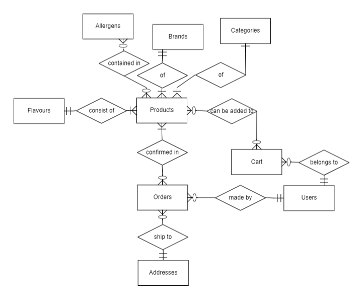
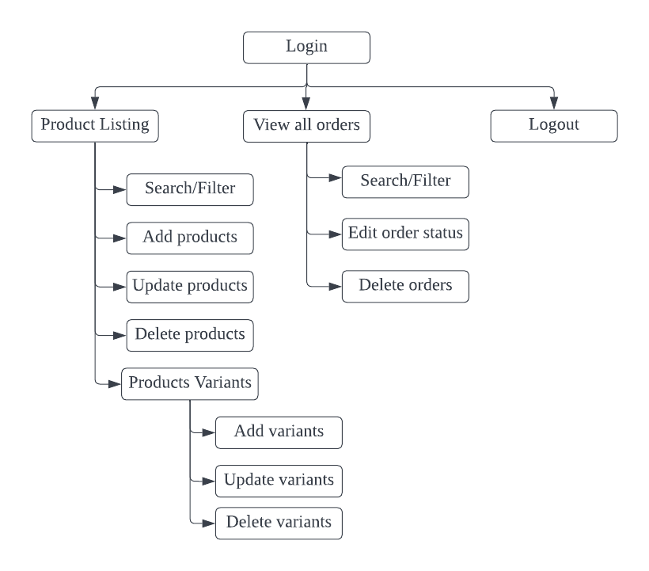

# Ripped


Live demo for customers can be accessed [here](https://mrripped.netlify.app/).
* Test Account: 
    * Email: hellorave@gemail.com
    * Password: asdfg

Live demo for admin/shop owners can be accessed [here](https://hww-tgc18-project-03.herokuapp.com/admin/login).
* Test Account: 
    * Email: janedoe@gemail.com
    * Password: qwerty

## Project Overview 

**Context and Value Proposition**

With the increased awareness of nutrition and healthy-lifestyle, more people are working at the gym than before <sup>[`[1]`](https://www.straitstimes.com/singapore/more-people-working-out-at-gyms-than-before-the-pandemic)</sup> and looking for protein-enriched products to add-on for perceived additional benefits <sup>[`[2]`](https://www.todayonline.com/singapore/protein-shakes-and-supplements-are-helpful-add-ons-some-should-never-replace-real-food-say)</sup>.   

This e-commerce web application project, Ripped, aims to ride on this emerging trend and rising demand for protein-based supplements.   

## UI/UX 

**1. Strategy**

**Organisation's Goals** 

To establish an e-commerce store selling a wide variety of protein supplements of different categories, and brands ranging from local to international. 

**User** 

- Demographic: Mainly targetting young to middle age (20-59 years old) athletes or gym goers looking for protein supplements to meet their nutritional goals 

- Needs: Search for protein supplements according to their category of usage and/or allergens 

- Pain points: most ecommerce stores sell only one or selected brands of protein supplements  

| User Stories | Acceptance Criteria(s) |
| ------------ | ---------------------- |
| As a gym goer/athlete, I woud like to look for familiar brands/flavours of protein supplements that I usually consume | Website helps users to search products by product name, brand or flavours |
| As a gym goer/athlete with known allergies, I woud like to look avoid protein supplements with allergens to consume | Products are labelled with the types of allergens they contain |
| As an ectomorph or endomorph body type, I would like to be able to look for protein supplements to bulk up or to aid in weight loss | Website helps users to search products category (eg. Mass gainer, fat burner etc) |

**2. Scope** 

**Database**

ERD Diagram

<figure>
    
</figure>

Logical Schema


**Functional**

* For customers: 
    * Account registration, view profile, login and logout
    * Browse product listing, filter/search products and view details of individual product
    * Add products to cart 
    * Cart management (update quantity of products, remove products from cart and checkout/make payment via Stripe)

* For admins/shop owners: 
    * Register, login and logout for admin/shop owner
    * Product and product's variants management (create, read, update, delete)
    * Filter/search for products
    * Orders management (view order details, update order status, delete order)
    * Filter/search for orders

**Non-Functional** 

- Application is mobile responsive

**3. Structure** 

**Frontend/Users**

 

Checkout, order details, user profile and logout are only accessible after user has logged in successfully. 

**Backend/Owner**
<figure>
    
</figure>

**4. Skeleton**

**Frontend**

Rough sketch can be found [here](./project-03/readme/Skeleton.jpeg)

**5. Surface**

**Fonts** 

- Kanit: Brand logo
- Permanent Marker: Tagline
- Montserrat: Nav-links
- Nunito: body 

**Icons** 

- Font Awesome: User and cart icons on navbar, trash bin icon in cart item
- React Bootstrap Icons: Facebook, Instagram, GitHub, LinkedIn icons on navbar

## Technologies Used 

**Frontend**

Technology                                                                                  | Description
------------------------------------------------------------------------------------------  | -----------
[Stripe](https://stripe.com/)                                                               | Payment gateway
[axios](https://github.com/axios/axios)                                                     | Axios as HTTP client to Express server endpoints
[Bootstrap 5](https://github.com/twbs/bootstrap)                                            | Bootstrap is used to create a mobile responsive web application
[ReactJS](https://reactjs.org/)                                                             | ReactJS is a frontend JavaScript framework used for building user interfaces specifically for single-page application
[react-hook-form](https://github.com/react-hook-form/react-hook-form)                       | React-Hook-Form is used to handle and validate forms in the application. 
[react-lottie-player](https://github.com/mifi/react-lottie-player)                          | Lottie is a JSON-based animation file format which is used for the loading animation for the web application.
[react-router-dom](https://github.com/remix-run/react-router)                               | Declarative routing for ReactJS
[react-toastify](https://fkhadra.github.io/react-toastify/introduction)                     | Toast notification for ReactJS

**Backend**

| Technology | Description |
| ------------ | ---------------------- |
| [Express](https://expressjs.com/) | Unopionated framework for routing to project's endpoints |
| [Handlebars](https://github.com/pillarjs/hbs) | Express.js view engine |
| [cors](https://www.npmjs.com/package/cors) | Middleware to enable CORS for Express.js |
| [csruf](https://www.npmjs.com/package/csurf) | Middleware to enable CSRF for Express.js |
| [dotenv](https://github.com/motdotla/dotenv) | Storing configuration in the environment separate from code |
| [express-session](https://www.npmjs.com/package/express-session) | Middleware to create sessions on Express.js |
| [express-flash](https://www.npmjs.com/package/express-flash) | Flash messages middleware |
| [JsonWebToken](https://github.com/auth0/node-jsonwebtoken) | Securely transmitting information between parties as a JSON object |
| [MySQL](https://www.mysql.com/) | Database |
| [db-migrate](https://db-migrate.readthedocs.io/en/latest/) | Database migration framework for Node.js |
| [Knex.js](https://knexjs.org/) | Query builder for PostgreSQL, MySQL, CockroachDB, SQL Server, SQLite3 and Oracle on Node.js |
| [Bookshelf](https://bookshelfjs.org/) | JavaScript ORM for Node.js, built on the Knex SQL query builder |
| [Caolan forms](https://github.com/caolan/forms) | Create, parse and validate forms in Node.js |
| [Cloudinary](https://cloudinary.com/) | Image hosting service used to upload and store the project's images |
| [Stripe](https://stripe.com/en-sg) | Payment gateway |


## Testing 

Test Cases can be found [here]()

## Deployment 

**Frontend Deployment**

The React app is hosted using [Netlify](https://www.netlify.com/).

1. Sign up for an account at Netlify
    - Go to https://www.netlify.com/ and log in with your Github account. 
2. Commit and push your code to Github
    - Commit and push your latest code.
3. Create a new site from Git
    - Click on "New site from Git"
4. Choose Continuous Deployment
5. Select or search for your repo 
    - Select the repo to deploy and select the Deploy Site button.
6. Wait for deployment to be done

**Backend Deployment**

Express server is deployed using [Heroku](https://www.heroku.com/).

Prerequisites:
- Heroku is connected and authorized to Github account under "Deploy"
- Correct repository is selected under "App connected to Github"
- Automatic deploys have been enabled for continuous deployment

Steps to publish:
1. After connecting to repository, ensure edits were added, commited, and pushed to Github repository
2. Heroku will perform automatic deployments upon detecting changes

The following environment variables: 
```
CLOUDINARY_NAME=
CLOUDINARY_API_KEY=
CLOUDINARY_API_SECRET=
CLOUDINARY_UPLOAD_PRESET=
DB_DRIVER=
DB_USER=
DB_PASSWORD=
DB_DATABASE=
DB_HOST=
STRIPE_PUBLISHABLE_KEY=
STRIPE_SECRET_KEY=
STRIPE_SUCCESS_URL=
STRIPE_CANCEL_URL=
STRIPE_ENDPOINT_SECRET=
TOKEN_SECRET=
REFRESH_TOKEN_SECRET=
```

## Challenges and Future Implementations 

1. Allow users to have more search criteria under product listing page, eg. allergens, cost, serving size, and nutrition information (e.g total calories, protein, carbohydrates, fats)
2. Allow users to update quantity of cart items by clicking on increase/decrease buttons similar to the ones when adding to cart. 
3. An addition 'Confirm Password' field when user registers. 
4. Allow users to reset their password under profile page. 
5. Allow admin to view user accounts, update user information and delete a user. 
6. Improve layout and design of admin/shop owner's page


## Credits 

**Fonts, Icons and Images** 

- [Google Font](https://fonts.google.com/about) - brand logo, tagline font and web pages fonts 
- [Font Awesome](https://fontawesome.com/) - user and cart icons on navbar, trash bin icon in cart item
- [React Bootstrap Icons](https://www.npmjs.com/package/react-bootstrap-icons) - Facebook, Instagram, GitHub, LinkedIn icons on navbar
- [Bootstrap 5](https://getbootstrap.com/) - Components and utilities
- [Unsplash](https://unsplash.com/) - Landing page backgroud image  
- [Coolors](https://coolors.co/820263-d90368-eadeda-2e294e-ffd400) - Choosing complementary colours
 

**Others** 
- [Lucidchart](https://www.lucidchart.com/pages/) - Design structure of page 
- [Bytes](https://ui.dev/amiresponsive) - Display mobile responsiveness
- Product information, product images and web layouts: 
    - [MyProtein](https://www.myprotein.com.sg/)
    - [The Nutri X](https://www.thenutrix.com/)
    - [Cellucor](https://cellucor.com/)
    - [MuscleTech](https://www.muscletech.com/)
    - [Optimum Nutrition](https://www.optimumnutrition.com/en-us)
    - [GNC](https://www.gnc.com/)
- TGC community for guidance on various problems encountered
